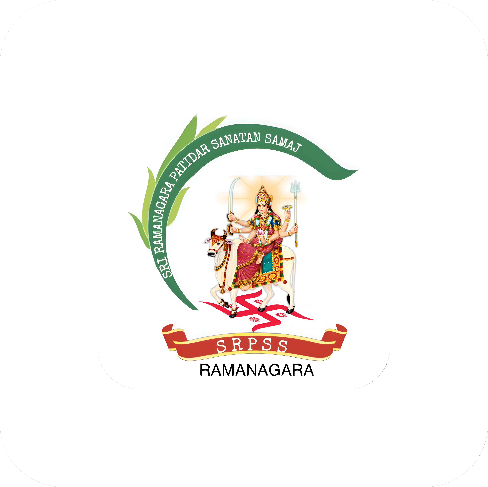

<div align="center">
  
  <h1>Community Management Application</h1>
  <p><em>Connecting, Organizing, and Securing Communities through Modern Mobile Experiences</em></p>
  
  [](https://flutter.dev/)
  [](https://firebase.google.com/)
  [](https://dart.dev/)
</div>

<br/>

## 📖 Overview
The **Community Management App** is a highly scalable, enterprise-grade Flutter application built to streamline operations for large communities, organizations, and professional networking groups. 

Consisting of over **25,000+ lines of native Dart code**, this application implements a robust MVC-style architecture, combining local biometric security, advanced NoSQL schema design via Cloud Firestore, and real-time push notification broadcasts.

## ✨ Core Features

### 🛡️ Role-Based Access Control & Security
- **Multi-tier User Roles**: Strict separation of capabilities between `Admin`, `Manager`, and general `Users`.
- **Biometric Authentication**: Secure log-ins via device-native biometrics (FaceID/Fingerprint).
- **System Health Monitoring**: Built-in diagnostics tracking app stability, storage health, and database connection.

### 👥 Hierarchical Member Management
- **Families & Sub-Families**: Group individuals by families, handling relationships seamlessly.
- **Dynamic Family Trees**: Visually stunning, auto-generating family tree nodes.
- **Corporate Firm Associations**: Associate members with primary Firms and specialized Sub-Firms for B2B/Corporate profiling.

### 📅 Advanced Event & Attendance Tracking
- **Interactive Calendar**: View upcoming community events dynamically.
- **Smart Attendance System**: Allows marking presence based on entire Families, Sub-families, or Firms with lightning speed.
- **QR Code Networking**: Automatically-generated Digital ID Cards with scannable QR codes for swift event check-ins and member profiling.

### 📊 Real-Time Analytics Dashboard
- Track total engagements, monthly user growths, and attendance retention all represented through beautiful interactive charts (`fl_chart`).

### 🌍 Localization & Accessibility
- **Multi-lingual**: Fully dynamic translation services actively supporting **English** and **Gujarati**.
- **Dynamic Theming**: Fluid Light/Dark mode transitions with accessible, scalable typography.

---

## 🛠️ Technology Stack
- **Frontend**: Flutter / Dart
- **Backend**: Firebase (Cloud Firestore, Functions, Cloud Messaging, Auth, Storage)
- **Media Optimization**: ImageKit integration for lightning-fast photo delivery.
- **State Management**: Provider

---

## 🚀 Getting Started

### Prerequisites
1. Install [Flutter SDK](https://docs.flutter.dev/get-started/install) (v3.10.3 or higher).
2. Install [Android Studio](https://developer.android.com/studio) or Xcode for iOS compilation.
3. Access to a Firebase Project containing active `google-services.json` (Android) and `GoogleService-Info.plist` (iOS).

### Installation
1. Clone this repository to your local machine:
   ```bash
   git clone https://github.com/your-username/community-app.git
   ```
2. Fetch dependencies:
   ```bash
   flutter pub get
   ```
3. Run the static analyzer to ensure project health:
   ```bash
   flutter analyze
   ```
4. Run the app on your connected device/emulator:
   ```bash
   flutter run
   ```

---

## 💎 Project Valuation & Enterprise Potential
This application was engineered to handle robust, complex community networking similar to high-end SaaS platforms. The codebase is immense, modular, and built for immense data scaling.

* **Development Effort Estimate**: ~800 Development Hours
* **Enterprise Value / Exclusive IP Sale**: **$30,000 – $60,000 USD** (₹25,000,000 - ₹54,00,000 INR) depending on market exclusivity rights.
* **White-Label / Local Licensing potential**: Extremely viable for $5,000 - $12,000 USD (₹400,000 - ₹12,00,000 INR) per local community client, with recurring maintenance fees.

---
<div align="center">
  <p><strong>Created by Meet Patel • The Box Creations</strong></p>
  <p><em>Building solutions for tomorrow.</em></p>
</div>
